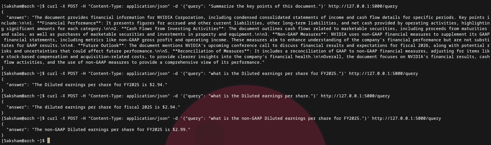

# IntelliDoc – RAG-Powered Document Intelligence System

IntelliDoc is an AI-driven document understanding and question-answering platform built using Retrieval-Augmented Generation (RAG). It allows users to upload PDFs, process them into vector embeddings, and ask natural-language questions to retrieve accurate, context-grounded answers.

A custom frontend (stored in `frontend/`) provides an easy interface for document upload and querying, and a demo video is included to showcase the system end-to-end.

---

# Demo


## Working API demo

---

## Features

- **RAG Pipeline (Retrieval-Augmented Generation)**
  Combines semantic vector search with LLM-based response generation.

- **Multi-Document Support**
  All PDFs stored in `data/documents/` are processed and indexed together.

- **High-Speed Semantic Search**
  Uses FAISS for efficient retrieval over large document collections.

- **LLM-Powered Question Answering**
  OpenAI GPT models generate accurate, context-aware answers.

- **Frontend UI**
  Clean UI for uploading documents and interacting with the system.

- **REST API**
  `/upload` and `/query` endpoints provided via Flask.

---

## Tech Stack

- Python  
- LangChain  
- HuggingFace Transformers  
- FAISS  
- Flask  
- OpenAI GPT-4o-mini

Frontend:
- React
- Axios for API communication

---


### Prerequisites

- Python 3.10 or higher
- pip package manager
- OpenAI API key

### Installation

1. Clone the repository:
```bash
git clone https://github.com/yourusername/IntelliDoc.git
cd IntelliDoc
```

2. Create and activate a virtual environment:
```bash
python -m venv ragenv
source ragenv/bin/activate  # On Windows: ragenv\Scripts\activate
```

3. Install dependencies:
```bash
pip install -r requirements.txt
```

4. Create a `.env` file in the project root:
```
OPENAI_API_KEY=your_api_key_here
```
5. run flask app
```
python app.py
```
7. install node packages for frontend
```
cd frontend && npm install
```
7. run frontend
```
cd frontend && npm run dev
```

## Usage without frontend

1. Place your PDF documents in the `data/documents` folder

2. Run the Flask application:
```bash
python app.py
```

3. Upload a document:
```bash
curl -X POST -F "file=@your_document.pdf" http://localhost:5000/upload
```

4. Query your document:
```bash
curl -X POST -H "Content-Type: application/json" \
     -d '{"query":"your question here"}' \
     http://localhost:5000/query
```

## Contributing

Feel free to fork this project and submit pull requests. You can also open issues for bugs or feature requests.

## License

This project is open source and available for anyone trying to complete thier project :)